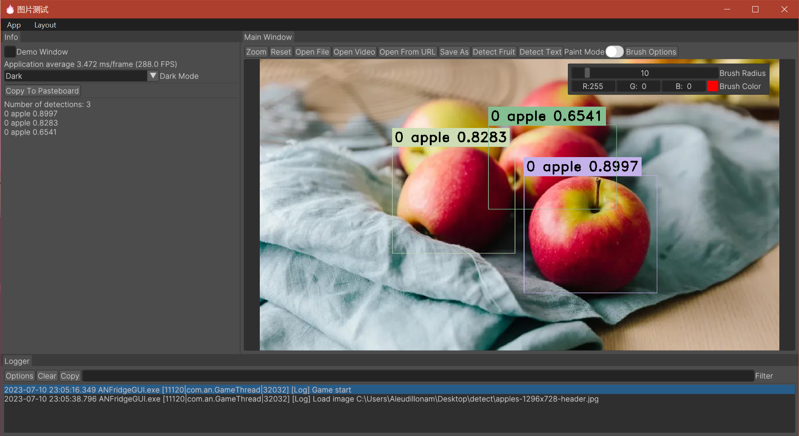
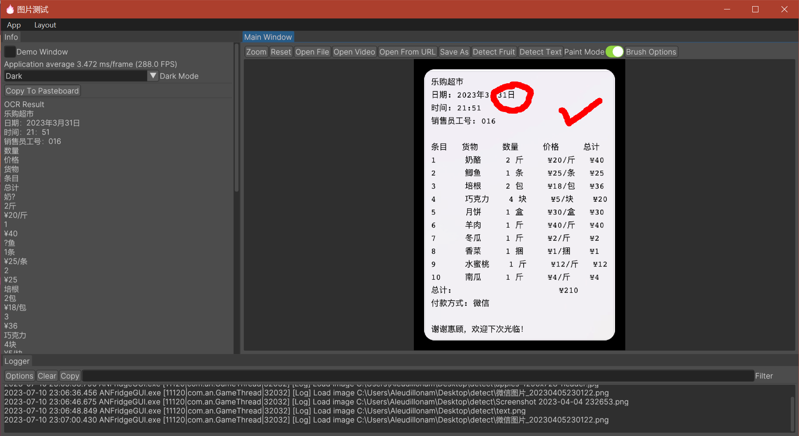

#### ANFridge : 微信小程序 “智能冰箱管家” 图像识别模块的服务端
***

微信小程序地址：#小程序://智能冰箱管家/TKhPhogh6PmUzoI

本项目基于Yolov8和OpenCV，能有效地识别冰箱内的各种物品。同时，系统也借助PaddleOCR实现对购物清单的文本识别。在系统的通信方面，我们采用了gRPC来实现服务端的通信，保证了信息的高效流通。

此外，本项目还包括一个在Windows系统下运行的演示客户端，其功能是通过FFmpeg实现的。这个客户端的框架采用了我的游戏引擎Demo项目（https://github.com/stmxmv/ojoie）。通过这个客户端，用户可以识别图片或视频中的物品，提供了一个直观的操作界面。

客户端演示图片如下：

